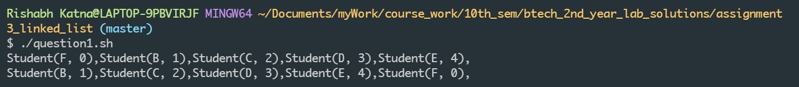
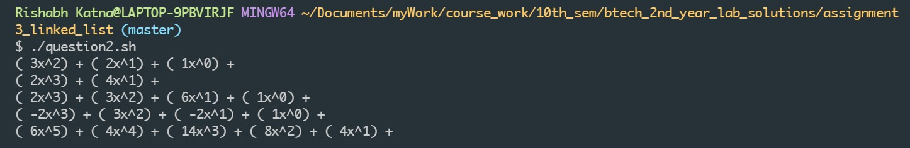

# Linked List Assignment

### Important Instructions:
1. Treat this assignment as a coding guide rather than a linked list tutorial.

2. Try to design your next data structures in a similar manner. (not required).

### Run the programs:
_Use the following instructions to run the programs. However the true behaviour of our data structures can only be understood using unit tests. Switch to the test directory, take a look at the tests and run the tests to see the whole functionality of our data structures._

1. For question1 (LinkedList), run the following command:
`./question1.sh`. You should see an output like the following:

2. For question2 (Polynomial), run the following command:
`./question2.sh`. You should see an output like the following:

#### if you don't see these results, these can be the possible solutions
. For ubuntu users, run this command before running the shell scripts:
`chmod +x ./question1.sh` or `chmod +x ./question2.sh` (I believe these are the correct commands. If not, just look it up on google :) )

. For other errors, just google or reach out to us.

### Design details:

1. Rather than using a nullptr as the initial value of head node, I have taken a dummy head with garbage value as the head node. It makes some algorithms much easier to implement.
#### I will leave the exploration of various insertion and deletion algorthms upto you

2. Some algorithms are not optimal in terms of performance. This decision was made to improve code quality. However I would suggest you to write the most optimal code for now. 

#### You can even come up with more versions of my solutions and add pull requests to this branch. If correct, I will gladly merge them in my master branch.

3. There are some bugs in the code which haven't been addressed yet. You can try to find those bugs, fix them and add pull requests to this repository also.

4. You can also clone this repo and make a more efficient and cleaner version of this assignment. I will gladly merge that in this repository if it looks fine to me.

5. Add unit tests for every feature you want to add or for every bug you want to fix. Also show how the bug is produced. Run all the tests to make sure your solution didn't break any other part of the code.

